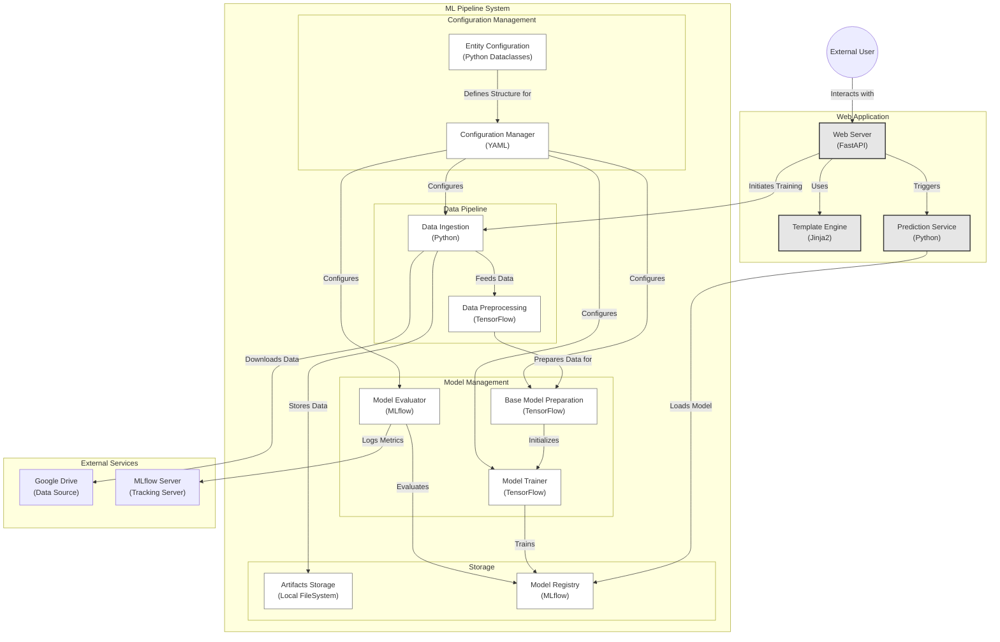

# Automated Pulmonary Adenocarcinoma Detection System

## Project Description

This work develops an automated detection system for pulmonary adenocarcinomas through the analysis of medical images, implemented as a web application. The system allows users to upload images via an intuitive interface, which are processed by an API running an image classification model based on advanced deep learning techniques. The model provides a binary diagnosis regarding the presence or absence of adenocarcinomas.

In addition to the clinical objective, this project focuses on creating a modular and structured template that covers all stages of the typical workflow in image classification. The proposed architecture integrates components such as:

- Data preprocessing
- Modeling
- Deployment
- Code management

This approach ensures scalability, maintainability, and facilitates the replication of the system to address similar problems in the field of computer vision.

## Methodology

### 1. Data Collection

The pulmonary adenocarcinoma dataset available on Kaggle was used, consisting of images categorized into two classes:

- Presence of adenocarcinomas
- Absence of adenocarcinomas

The images were preprocessed to conform to the size required by the VGG16 architecture (224x224 pixels) and normalized to the [0, 1] range.

### 2. Data Augmentation

To improve the model’s generalization and avoid overfitting, data augmentation techniques were implemented:

- Rotations of up to 15 degrees
- Random scaling
- Horizontal and vertical translations
- Horizontal flipping

### 3. Model Used

The VGG16 architecture with pre-trained weights on ImageNet was used. The original fully connected layers were replaced by a dense classifier that includes:

- A fully connected layer with 256 units and ReLU activation
- A 50% dropout to reduce overfitting
- A final layer with sigmoid activation for binary predictions

### 4. Model Training

The model was trained using:

- Loss function: `binary_crossentropy`
- Optimizer: Adam (initial learning rate: 0.01)
- Epochs: 30
- Batch size: 16
- Data split: 80% for training, 20% for validation

### 5. Model Evaluation

Performance was evaluated using the metrics of accuracy and loss on the validation set. Graphs were also generated to monitor the accuracy and loss curves during training.

## Results

### Key Metrics

- **Loss:** 0.048
- **Accuracy:** 99.02%

### Observations

- The model demonstrated a high ability to distinguish between images with and without adenocarcinomas.
- False positives and negatives were mainly identified in low-resolution images or those with artifacts, highlighting the importance of high-quality data.

### Graphs

The accuracy and loss curves showed stable convergence, evidencing a good fit without significant signs of overfitting.

## Conclusion

The developed system achieved an accuracy of 99.02% in the detection of pulmonary adenocarcinomas. Moreover, the designed modular template facilitates its application to other image classification problems, offering a reusable and scalable approach.

### Limitations

- Sensitivity to low-resolution images
- Presence of false positives and negatives in certain scenarios

### Future Work

1. Integrate explainability tools such as Grad-CAM to interpret the model’s predictions.
2. Evaluate the system in a real clinical environment with real-time data.
3. Explore additional techniques such as super-resolution to improve robustness against low-quality images.

## How to Use This Project

1. **Install dependencies:**

   ```bash
   conda env create -f environment.yml
   conda activate cnn-cancer-classifier
   ```

2. **Run the pipeline with DVC:**

   ```bash
   dvc init
   dvc repro
   ```

3. **Run the web application:**

   ```bash
   python app.py
   ```

4. **Open the interface:**
   Access `http://localhost:8080` in your browser.

---

**Note:** If you need more information or have any questions, feel free to open an issue in the repository.


